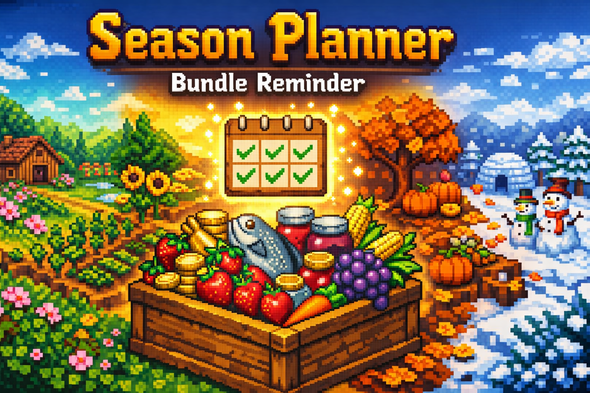
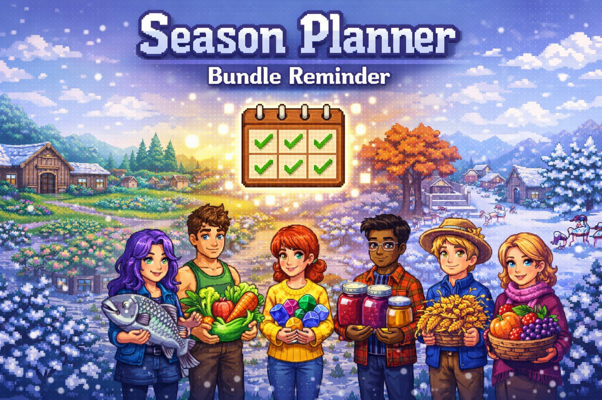
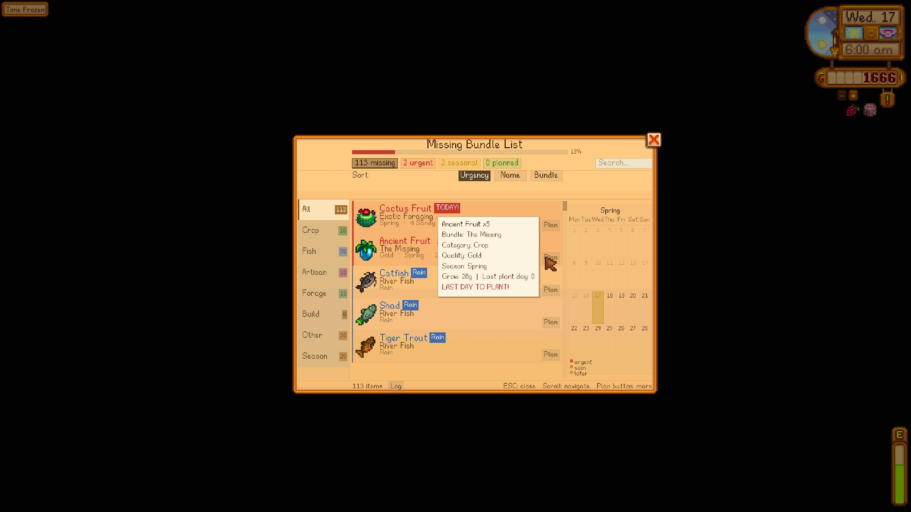
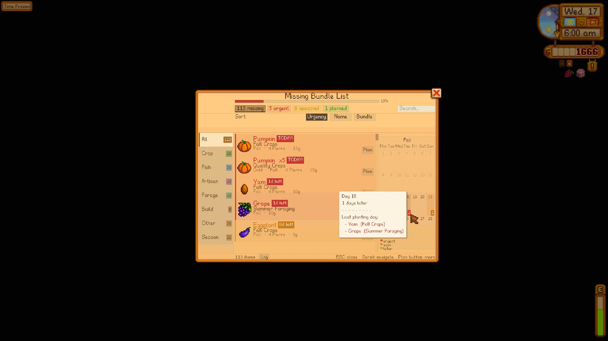
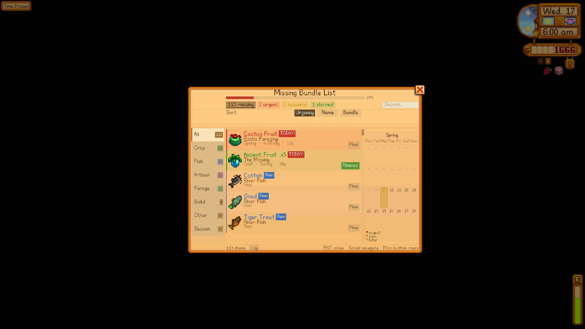
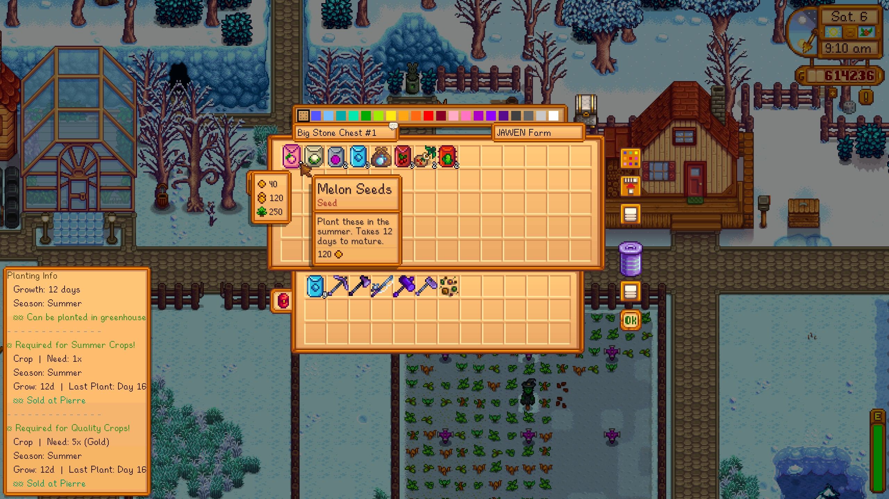
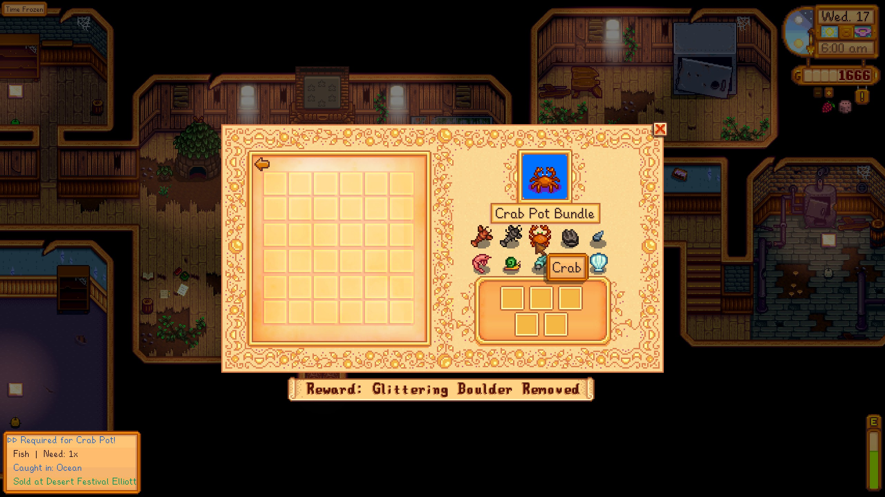
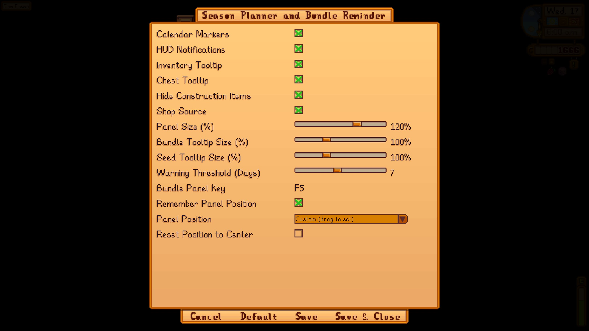
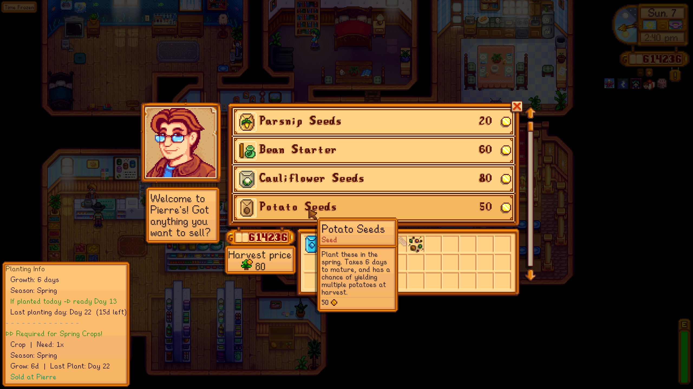
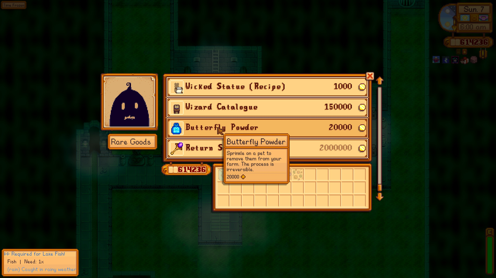

<div align="center">



# Season Planner & Bundle Reminder

**Never miss a planting deadline or bundle item again.**  
A SMAPI mod for Stardew Valley that tracks your Community Center progress, marks deadlines on the calendar, and keeps you one step ahead every season.

<br/>

[](https://smapi.io)
[](https://www.stardewvalley.net/)
[](manifest.json)
[](LICENSE)
[](#-languages)

<br/>

[**Download on Nexus Mods**](https://www.nexusmods.com/stardewvalley/mods/43803) · [**GitHub Releases**](https://github.com/devjawen/stardew-season-planner/releases) · [**Report a Bug**](https://github.com/devjawen/stardew-season-planner/issues) · [**Discussions**](https://github.com/devjawen/stardew-season-planner/discussions)

</div>

---

## What's New in 1.4.0

- **Search bar** — filter the bundle panel by item name or bundle name in real time
- **Detailed calendar** — 7-column week layout (Mon-Sun) with item count badges on deadline days and hover tooltips showing which items are due
- **Community Center tooltips** — hover ingredient icons inside a bundle to see fish location, season, time range, and weather conditions
- **Completed bundle items** — tooltips now show a green "Delivered" line for already-completed items
- **Notification log** — review past HUD alerts inside the panel (Log tab)
- **Mod fish support** — fish from modded locations (SVE, etc.) now show correct location and season data
- **Bilingual SMAPI logs** — all console messages shown in both Turkish and English
- **Bundle cache fix** — completed slots tracked correctly; no false "missing" items after delivery
- **Full i18n** — every string goes through the translation system; no hardcoded text remains
- **Code cleanup** — all comment lines removed from source files

---

## What it does

Open the bundle panel with `F5` and see every missing Community Center item at a glance — sorted by urgency, filtered by category, with planting deadlines, shop sources, and rain-fish alerts all in one place.

- **Bundle Panel** — missing items grouped by category (Crop, Fish, Artisan, Forage, Build, Other), sortable by urgency / name / bundle
- **Search** — type to filter items or bundles instantly
- **Calendar View** — 7-column week layout with deadline badges and hover tooltips
- **HUD Alerts** — morning notifications for planting deadlines, rain-fish opportunities, and planned item completions
- **Inventory, Chest & Shop Tooltips** — hover any item to see which bundle it belongs to
- **Community Center Tooltips** — hover ingredient icons inside a bundle for fish location, season, time, and weather info
- **Seed Tooltips** — hover a seed to see grow time, season, last planting day, and greenhouse info
- **Planning** — mark items as "planned", filter to planned-only view, get notified when a planned item is completed
- **Notification Log** — review all past HUD alerts from the current session inside the panel
- **Responsive Layout** — panel scales to any screen size; calendar column hides on small screens
- **Mod Compatible** — works with Content Patcher mods, SVE, Cornucopia, Bonster's Crops, and more

---

## Screenshots

<div align="center">

</div>

<br/>

| Bundle Panel — Details | Bundle Panel — Calendar |
|:---:|:---:|
|  |  |

| Bundle Panel — Planned Items | Inventory Tooltip |
|:---:|:---:|
|  |  |

| Community Center Tooltip | Settings (GMCM) |
|:---:|:---:|
|  |  |

| Pierre's Shop | Willy's Shop | Sandy's Shop |
|:---:|:---:|:---:|
|  |  |  |

| Krobus Shop |
|:---:|
|  |

---

## Installation

**Requirements**
- Stardew Valley `1.6+`
- [SMAPI](https://smapi.io) `4.1+`
- [Generic Mod Config Menu](https://www.nexusmods.com/stardewvalley/mods/5098) *(optional, for in-game settings)*

**Steps**
1. Download the latest zip from [Nexus Mods](https://www.nexusmods.com/stardewvalley/mods/43803) or [GitHub Releases](https://github.com/devjawen/stardew-season-planner/releases)
2. Extract into your `Stardew Valley/Mods/` folder
3. Launch the game through SMAPI

```
Stardew Valley/Mods/SeasonPlanner/
├── SeasonPlanner.dll
├── manifest.json
└── i18n/
    ├── default.json
    └── tr.json
```

---

## Configuration

All settings are available in-game via **Generic Mod Config Menu**, or by editing `config.json`.

| Setting | Default | Description |
|---|:---:|---|
| Show Calendar Markers | on | Highlight last planting days on the calendar |
| Show HUD Notifications | on | Morning alerts for deadlines and rain fish |
| Show Inventory Tooltips | on | Bundle info on hovered inventory items |
| Show Chest Tooltips | on | Bundle info on hovered chest items |
| Show Shop Source | on | Where to buy items, shown in tooltips |
| Filter Construction Items | on | Hide Wood/Stone/etc. from the panel |
| Warning Threshold (Days) | `7` | How many days before deadline to start warning |
| Panel Hotkey | `F5` | Key to open/close the bundle panel |
| Remember Panel Position | on | Save panel position between sessions |
| Panel Size (%) | `100` | Scale the bundle panel (50-150%) |
| Bundle Tooltip Size (%) | `100` | Scale the bundle info tooltip (50-200%) |
| Seed Tooltip Size (%) | `100` | Scale the planting info tooltip (50-200%) |

---

## Controls

| Input | Action |
|---|---|
| `F5` | Open / close the bundle panel |
| `ESC` or right-click | Close the panel |
| Scroll wheel | Navigate the item list |
| Click a tab | Filter by category |
| Click a chip | Filter by urgency / season / planned |
| Type in search box | Filter by item or bundle name |
| Click "Plan" | Mark an item as planned |
| Drag panel header | Reposition the panel |

---

## Mod Compatibility

The mod reads `Data/Bundles`, `Data/Crops`, `Data/Shops`, `Data/Fish`, and `Data/Locations` through SMAPI's content API, so any mod that patches those assets is automatically supported.

Explicitly tested / declared compatible:

| Mod | Support |
|---|---|
| Content Patcher | Full |
| Stardew Valley Expanded | Full |
| Cornucopia -- More Crops | Full |
| Cornucopia -- Cooking Recipes | Full |
| Bonster's Crops | Full |
| Culinary Delight | Full |
| Better Things | Full |
| Json Assets | Full |
| Dynamic Game Assets | Full |
| Generic Mod Config Menu | Full |

If you find an item from another mod that isn't showing correctly, open an [issue](https://github.com/devjawen/stardew-season-planner/issues) with the mod name and SMAPI log.

---

## Languages

| Language | File | Status |
|---|---|:---:|
| English | `i18n/default.json` | done |
| Turkce | `i18n/tr.json` | done |
| *Your language?* | `i18n/xx.json` | open |

To add a translation: copy `i18n/default.json`, rename it to your language code, translate the values, and submit a PR.

---

## Building from Source

```bash
git clone https://github.com/devjawen/stardew-season-planner.git
cd stardew-season-planner
```

Set your game path in `Directory.Build.props` (not tracked by git), then build:

```bash
dotnet build -c Release
```

The mod is automatically copied to your `Mods/` folder and a release zip is generated in `bin/Release/net6.0/`.

---

## Contributing

Bug reports, translations, and pull requests are welcome.

- **Bug?** -> [Open an issue](https://github.com/devjawen/stardew-season-planner/issues) with your SMAPI log and mod list
- **Feature idea?** -> [Start a discussion](https://github.com/devjawen/stardew-season-planner/discussions)
- **Code contribution?** -> Fork -> branch -> PR, one feature per PR please

---

## Changelog

### 1.4.0
- Search bar added to bundle panel (filter by item or bundle name)
- Calendar redesigned to 7-column week layout with item count badges and hover tooltips
- Community Center tooltips: hover ingredient icons to see fish location, season, time, and weather
- Completed bundle items now show a green "Delivered" line in tooltips
- Notification log added to bundle panel (Log tab)
- Mod fish support: fish from modded locations now show correct data
- Bilingual SMAPI logs (TR/EN)
- Bundle cache fix: completed slots tracked correctly
- Full i18n: no hardcoded strings remain
- Source code cleanup: all comment lines removed

### 1.3.1
- Initial public release
- Bundle panel with category tabs, urgency sorting, and planning
- Calendar markers for last planting days
- HUD alerts for planting deadlines and rain fish
- Inventory, chest, and shop tooltips
- Seed and fruit tree tooltips
- Generic Mod Config Menu support
- English and Turkish translations

---

## License

[CC BY-NC-ND 4.0](LICENSE) -- free to use and share with attribution; no commercial use, no modified redistributions.

(c) 2024 Jawen

---

<details>
<summary><strong>Turkce</strong></summary>

<br/>

## Season Planner & Bundle Reminder

Stardew Valley'de Topluluk Merkezi paket ilerlemenizi takip eden, takvimde son ekim gunlerini isaretleyen ve akilli HUD bildirimleri gonderen bir SMAPI modudur.

### Ne yapar?

`F5` ile paket panelini acin ve tum eksik esyalari tek ekranda gorun -- aciliyete gore siralanmis, kategoriye gore filtrelenmis, ekim son gunleri, magaza kaynaklari ve yagmur baligi uyarilariyla birlikte.

- **Paket Paneli** -- eksik esyalar kategoriye gore gruplandirmis (Urun, Balik, Zanaat, Toplama, Insaat, Diger)
- **Arama** -- item veya demet adiyla aninda filtrele
- **Takvim Gorunumu** -- 7 sutunlu hafta duzeni, son ekim gunlerinde badge ve hover tooltip
- **HUD Uyarilari** -- sabah bildirimleri: ekim son gunleri, yagmur baligi firsatlari, planlanan item tamamlandi
- **Envanter, Sandik & Magaza Tooltip** -- esyanin uzerine gelin, hangi pakete ait oldugunu gorun
- **Topluluk Merkezi Tooltip** -- bundle icindeki malzeme ikonlarinin uzerine gelin, balik lokasyonu, mevsim, saat ve hava durumu bilgisi gorun
- **Tohum Tooltip** -- tohumun uzerine gelin, buyume suresi, mevsim ve son ekim gunu bilgisi
- **Planlama** -- esyalari "planlandı" olarak isaretleyin, tamamlandiginda bildirim alin
- **Bildirim Logu** -- gecmis HUD bildirimlerini panel icindeki Log sekmesinde gorun
- **Duyarli Arayuz** -- panel her ekran boyutuna uyum saglar
- **Mod Uyumlu** -- SVE, Cornucopia, Bonster ve diger Content Patcher modlariyla calisir

### 1.4.0 Yenilikler

- Arama cubugu eklendi
- Takvim 7 sutunlu hafta duzenine guncellendi, badge ve hover tooltip eklendi
- Topluluk Merkezi tooltip: malzeme ikonlarinin uzerinde balik lokasyonu, mevsim, saat ve hava durumu
- Tamamlanmis bundle itemlari icin yesil "Teslim Edildi" satiri eklendi
- Bildirim logu eklendi (panel icinde Log sekmesi)
- Modlu balik destegi: modlu lokasyonlardaki baliklar icin dogru veri gosteriliyor
- Iki dilli SMAPI loglari (TR/EN)
- Bundle cache duzeltmesi
- Tum metinler i18n sistemine tasindi

### Kurulum

1. [Nexus Mods](https://www.nexusmods.com/stardewvalley/mods/43803) veya [GitHub Releases](https://github.com/devjawen/stardew-season-planner/releases) sayfasindan indirin
2. `Stardew Valley/Mods/` klasorune cikarin
3. Oyunu SMAPI ile baslatın

**Gereksinimler:** Stardew Valley 1.6+, SMAPI 4.1+, *(istege bagli)* Generic Mod Config Menu

### Kontroller

| Tus | Islem |
|---|---|
| `F5` | Paneli ac / kapat |
| `ESC` veya sag tik | Paneli kapat |
| Scroll | Listede gezin |
| Sekmeye tikla | Kategoriye gore filtrele |
| Arama kutusuna yaz | Item veya demet adiyla filtrele |
| "Planla" butonu | Esyayi planlandı olarak isaretleyin |
| Panel basligini surukle | Paneli tasi |

### Lisans

[CC BY-NC-ND 4.0](LICENSE) -- atif ile kullanabilir ve paylasabilirsiniz; ticari kullanim ve degistirilmis surum yayinlamak yasaktir.

</details>

---

<div align="center">
  <sub>Made with coffee by <a href="https://github.com/devjawen"><b>Jawen</b></a></sub>
</div>
