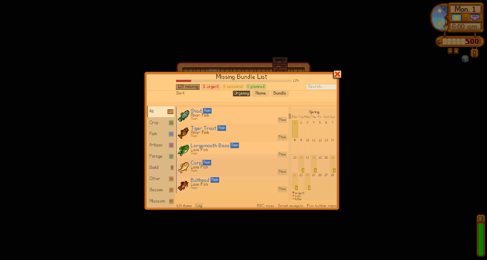
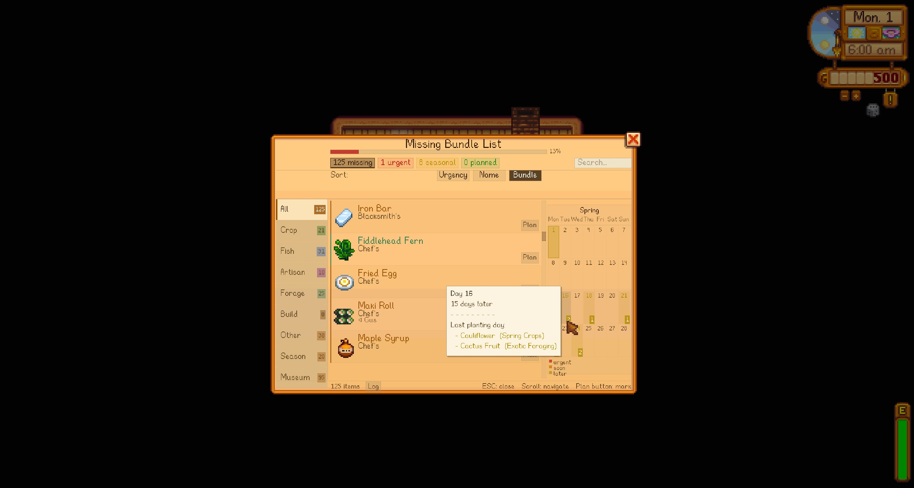

<div align="center">


# Season Planner & Bundle Reminder — Nexus Mods Page

**Tracks every missing Community Center bundle item, marks last planting days on the in-game calendar, and shows smart tooltips on inventory, chest, shop, and Community Center screens. Never miss a deadline again.**

<br/>

[](https://smapi.io)
[](https://www.stardewvalley.net/)
[](manifest.json)
[](LICENSE)
[](#languages)

</div>

---

> Bu dosya Nexus Mods mod sayfasının açıklama içeriğidir.
> Nexus Mods editörüne yapıştırırken aşağıdaki BBCode bölümünü kullan.

---

## Short Description

Tracks every missing Community Center bundle item, marks last planting days on the in-game calendar, and shows smart tooltips on inventory, chest, shop, and Community Center screens. Never miss a deadline again.

---

## Features

**Bundle Panel (F5)**
Open the panel from anywhere. Items are grouped by category (Crop, Fish, Artisan, Forage, Construction, Other) and sorted by urgency. Use the search bar to filter by item name or bundle name instantly.

<div align="center">

</div>

<div align="center">

</div>

**Calendar View**
Switch to the calendar tab inside the panel to see a 7-column week layout. Days with planting deadlines show item count badges. Hover a day to see which items are due.

<div align="center">

</div>

**Planning System**
Mark any item as "planned". Filter the list to planned-only view. When a planned item is delivered to the Community Center, you get a HUD notification.

<div align="center">

</div>

<div align="center">

</div>

**Museum Tab**
Track all museum donations in one place. Donated items are shown with a green badge and sorted to the bottom.

<div align="center">

</div>

**Inventory & Chest Tooltips**
Hover any item in your inventory or a chest to see which bundle it belongs to, how many are needed, quality requirements, and grow/season info.

<div align="center">

</div>

**Community Center Tooltips**
Open a bundle inside the Community Center and hover the ingredient icons. A tooltip shows the bundle name, required quantity, fish location, season, time range, and weather conditions — directly on the bundle screen.

<div align="center">

</div>

**Shop Tooltips**
Hover items in Pierre's, Willy's, Sandy's, Krobus's, and other shops to see bundle info without opening the panel.

| Pierre's Shop | Willy's Shop | Sandy's Shop |
|:---:|:---:|:---:|
|  |  |  |

| Krobus Shop |
|:---:|
|  |

**HUD Alerts**
Every morning the mod checks:
- Planting deadlines — warns you X days before the last day to plant a crop needed for a bundle
- Rain fish — if it will rain tomorrow and you still need a rain-only fish, you get a heads-up the night before
- Planned item completed — notifies you when a planned item is delivered

**Seed & Fruit Tree Tooltips**
Hover any seed or fruit tree sapling to see grow time, season, last planting day, and whether a greenhouse is available.

**Notification Log**
Inside the bundle panel, open the Log tab to review all past HUD notifications from the current session.

**Settings (Generic Mod Config Menu)**

<div align="center">

</div>

---

## What's New in 1.4.0

- **Search bar** — filter the bundle panel by item name or bundle name in real time
- **Detailed calendar** — 7-column week layout with item count badges and hover tooltips
- **Community Center tooltips** — hover ingredient icons inside a bundle to see fish location, season, time, and weather info
- **Completed bundle items** — tooltips now show a green "Delivered" line for already-completed items
- **Notification log** — review past HUD alerts inside the panel
- **Mod fish support** — fish from modded locations (SVE, etc.) now show correct location data
- **Bilingual SMAPI logs** — all console messages shown in both Turkish and English
- **Bundle cache fix** — completed slots tracked correctly, no false "missing" items
- **Full i18n** — every string goes through the translation system

---

## Installation

**Requirements**
- Stardew Valley `1.6+`
- [SMAPI](https://smapi.io) `4.1+`
- [Generic Mod Config Menu](https://www.nexusmods.com/stardewvalley/mods/5098) *(optional)*

**Steps**
1. Download the latest zip from the Files tab
2. Extract into your `Stardew Valley/Mods/` folder
3. Launch the game through SMAPI

---

## Controls

| Input | Action |
|---|---|
| `F5` | Open / close the bundle panel |
| `ESC` or right-click | Close the panel |
| Scroll wheel | Navigate the item list |
| Click a tab | Filter by category |
| Type in search box | Filter by item or bundle name |
| Click "Plan" | Mark an item as planned |
| Drag panel header | Reposition the panel |

---

## Configuration

| Setting | Default | Description |
|---|:---:|---|
| Show Calendar Markers | on | Highlight last planting days on the calendar |
| Show HUD Notifications | on | Morning alerts for deadlines and rain fish |
| Show Inventory Tooltips | on | Bundle info on hovered inventory items |
| Show Chest Tooltips | on | Bundle info on hovered chest items |
| Show Shop Source | on | Where to buy items, shown in tooltips |
| Filter Construction Items | on | Hide Wood/Stone/etc. from the panel |
| Warning Threshold (Days) | `7` | Days before deadline to start warning |
| Panel Hotkey | `F5` | Key to open/close the bundle panel |
| Panel Size (%) | `100` | Scale the bundle panel (50-150%) |
| Bundle Tooltip Size (%) | `100` | Scale the bundle info tooltip (50-200%) |
| Seed Tooltip Size (%) | `100` | Scale the planting info tooltip (50-200%) |

---

## Mod Compatibility

The mod reads `Data/Bundles`, `Data/Crops`, `Data/Shops`, `Data/Fish`, and `Data/Locations` through SMAPI's content API, so any mod that patches those assets is automatically supported.

| Mod | Support |
|---|---|
| Content Patcher | Full |
| Stardew Valley Expanded | Full |
| Cornucopia -- More Crops | Full |
| Cornucopia -- Cooking Recipes | Full |
| Bonster's Crops | Full |
| Culinary Delight | Full |
| Better Things | Full |
| Json Assets | Full |
| Dynamic Game Assets | Full |
| Generic Mod Config Menu | Full |

---

## Languages

| Language | File | Status |
|---|---|:---:|
| English | `i18n/default.json` | done |
| Türkçe | `i18n/tr.json` | done |
| *Your language?* | `i18n/xx.json` | open |

---

## Images (Upload Order for Nexus)

Nexus Mods'a bu sırayla yükle:

1. `images/1.4.0/Banner.png` — Ana banner
2. `images/1.4.0/Banner2.png` — İkinci banner
3. `images/1.4.0/bundlelistpanel.png` — Bundle panel genel
4. `images/1.4.0/bundlelistpaneldetails.jpg` — Bundle panel detay
5. `images/1.4.0/bundlelistpanelcalendar.png` — Takvim görünümü
6. `images/1.4.0/bundlelistpanelplanned.jpg` — Planlanan itemlar
7. `images/1.4.0/missingbundlelistplanned.jpg` — Eksik planlanan itemlar
8. `images/1.4.0/bundlelistpanelmuseum.jpg` — Müze sekmesi
9. `images/1.4.0/inventorytooltip.jpg` — Envanter tooltip
10. `images/1.4.0/communitycenter.jpg` — Community Center tooltip
11. `images/1.4.0/pierreshop1.jpg` — Pierre dükkanı
12. `images/1.4.0/willys shop.jpg` — Willy dükkanı
13. `images/1.4.0/sandys shop.jpg` — Sandy dükkanı
14. `images/1.4.0/krabus.jpg` — Krobus dükkanı
15. `images/1.4.0/genericmodmenusettings.jpg` — GMCM ayarlar

---

## Tags (Nexus Mods)

`Gameplay Mechanics` · `User Interface` · `Quality of Life` · `Utilities` · `HUD and UI`

---

## BBCode (Nexus Mods Editörüne Yapıştır)

<details>
<summary>BBCode içeriğini göster</summary>

```bbcode
[center][img]https://raw.githubusercontent.com/devjawen/stardew-season-planner/dev/images/1.4.0/Banner.png[/img][/center]

[center][size=5][b]Season Planner & Bundle Reminder[/b][/size]
[i]Never miss a planting deadline or bundle item again.[/i][/center]

[center]
[url=https://smapi.io][img]https://img.shields.io/badge/SMAPI-4.1%2B-2b8a3e?style=flat-square[/img][/url]
[url=https://www.stardewvalley.net/][img]https://img.shields.io/badge/Stardew%20Valley-1.6%2B-c0692e?style=flat-square[/img][/url]
[img]https://img.shields.io/badge/Version-1.4.0-blueviolet?style=flat-square[/img]
[img]https://img.shields.io/badge/Languages-EN%20%7C%20TR-informational?style=flat-square[/img]
[/center]

[line]

[size=4][b]What is this mod?[/b][/size]

Season Planner tracks your Community Center progress and makes sure you never miss a bundle item, planting deadline, or rain-fish opportunity. Press [b]F5[/b] to open the bundle panel at any time and see everything you still need — sorted by urgency, filtered by category, with grow times, shop sources, and seasonal info all in one place.

[line]

[size=4][b]Features[/b][/size]

[b]Bundle Panel (F5)[/b]
Open the panel from anywhere. Items are grouped by category (Crop, Fish, Artisan, Forage, Construction, Other) and sorted by urgency. Use the search bar to filter by item name or bundle name instantly.

[img]https://raw.githubusercontent.com/devjawen/stardew-season-planner/dev/images/1.4.0/bundlelistpanel.png[/img]
[img]https://raw.githubusercontent.com/devjawen/stardew-season-planner/dev/images/1.4.0/bundlelistpaneldetails.jpg[/img]

[b]Calendar View[/b]
Switch to the calendar tab inside the panel to see a 7-column week layout. Days with planting deadlines show item count badges. Hover a day to see which items are due.

[img]https://raw.githubusercontent.com/devjawen/stardew-season-planner/dev/images/1.4.0/bundlelistpanelcalendar.png[/img]

[b]Planning System[/b]
Mark any item as "planned". Filter the list to planned-only view. When a planned item is delivered to the Community Center, you get a HUD notification.

[img]https://raw.githubusercontent.com/devjawen/stardew-season-planner/dev/images/1.4.0/bundlelistpanelplanned.jpg[/img]
[img]https://raw.githubusercontent.com/devjawen/stardew-season-planner/dev/images/1.4.0/missingbundlelistplanned.jpg[/img]

[b]Museum Tab[/b]
Track all museum donations in one place. Donated items are shown with a green badge and sorted to the bottom.

[img]https://raw.githubusercontent.com/devjawen/stardew-season-planner/dev/images/1.4.0/bundlelistpanelmuseum.jpg[/img]

[b]Inventory & Chest Tooltips[/b]
Hover any item in your inventory or a chest to see which bundle it belongs to, how many are needed, quality requirements, and grow/season info.

[img]https://raw.githubusercontent.com/devjawen/stardew-season-planner/dev/images/1.4.0/inventorytooltip.jpg[/img]

[b]Community Center Tooltips[/b]
Open a bundle inside the Community Center and hover the ingredient icons. A tooltip shows the bundle name, required quantity, fish location, season, time range, and weather conditions — directly on the bundle screen.

[img]https://raw.githubusercontent.com/devjawen/stardew-season-planner/dev/images/1.4.0/communitycenter.jpg[/img]

[b]Shop Tooltips[/b]
Hover items in Pierre's, Willy's, Sandy's, Krobus's, and other shops to see bundle info without opening the panel.

[img]https://raw.githubusercontent.com/devjawen/stardew-season-planner/dev/images/1.4.0/pierreshop1.jpg[/img]
[img]https://raw.githubusercontent.com/devjawen/stardew-season-planner/dev/images/1.4.0/willys%20shop.jpg[/img]
[img]https://raw.githubusercontent.com/devjawen/stardew-season-planner/dev/images/1.4.0/sandys%20shop.jpg[/img]
[img]https://raw.githubusercontent.com/devjawen/stardew-season-planner/dev/images/1.4.0/krabus.jpg[/img]

[b]HUD Alerts[/b]
Every morning the mod checks:
[list]
[*] Planting deadlines — warns you X days before the last day to plant a crop needed for a bundle
[*] Rain fish — if it will rain tomorrow and you still need a rain-only fish, you get a heads-up the night before
[*] Planned item completed — notifies you when a planned item is delivered
[/list]

[b]Seed & Fruit Tree Tooltips[/b]
Hover any seed or fruit tree sapling to see grow time, season, last planting day, and whether a greenhouse is available.

[b]Notification Log[/b]
Inside the bundle panel, open the Log tab to review all past HUD notifications from the current session.

[b]Settings (Generic Mod Config Menu)[/b]
All options are configurable in-game via GMCM.

[img]https://raw.githubusercontent.com/devjawen/stardew-season-planner/dev/images/1.4.0/genericmodmenusettings.jpg[/img]

[line]

[size=4][b]What's New in 1.4.0[/b][/size]

[list]
[*] [b]Search bar[/b] — filter the bundle panel by item name or bundle name in real time
[*] [b]Detailed calendar[/b] — 7-column week layout with item count badges and hover tooltips
[*] [b]Community Center tooltips[/b] — hover ingredient icons inside a bundle to see fish location, season, time, and weather info
[*] [b]Completed bundle items[/b] — tooltips now show a green "Delivered" line for already-completed items
[*] [b]Notification log[/b] — review past HUD alerts inside the panel
[*] [b]Mod fish support[/b] — fish from modded locations (SVE, etc.) now show correct location data
[*] [b]Bilingual SMAPI logs[/b] — all console messages shown in both Turkish and English
[*] [b]Bundle cache fix[/b] — completed slots tracked correctly, no false "missing" items
[*] [b]Full i18n[/b] — every string goes through the translation system
[/list]

[line]

[size=4][b]Installation[/b][/size]

[b]Requirements[/b]
[list]
[*] Stardew Valley 1.6+
[*] [url=https://smapi.io]SMAPI 4.1+[/url]
[*] [url=https://www.nexusmods.com/stardewvalley/mods/5098]Generic Mod Config Menu[/url] (optional)
[/list]

[b]Steps[/b]
[list=1]
[*] Download the latest zip from the Files tab
[*] Extract into your Stardew Valley/Mods/ folder
[*] Launch the game through SMAPI
[/list]

[line]

[size=4][b]Controls[/b][/size]

[table]
[tr][th]Input[/th][th]Action[/th][/tr]
[tr][td]F5[/td][td]Open / close the bundle panel[/td][/tr]
[tr][td]ESC or right-click[/td][td]Close the panel[/td][/tr]
[tr][td]Scroll wheel[/td][td]Navigate the item list[/td][/tr]
[tr][td]Click a tab[/td][td]Filter by category[/td][/tr]
[tr][td]Type in search box[/td][td]Filter by item or bundle name[/td][/tr]
[tr][td]Click "Plan"[/td][td]Mark an item as planned[/td][/tr]
[tr][td]Drag panel header[/td][td]Reposition the panel[/td][/tr]
[/table]

[line]

[size=4][b]Configuration[/b][/size]

[table]
[tr][th]Setting[/th][th]Default[/th][th]Description[/th][/tr]
[tr][td]Show Calendar Markers[/td][td]On[/td][td]Highlight last planting days on the calendar[/td][/tr]
[tr][td]Show HUD Notifications[/td][td]On[/td][td]Morning alerts for deadlines and rain fish[/td][/tr]
[tr][td]Show Inventory Tooltips[/td][td]On[/td][td]Bundle info on hovered inventory items[/td][/tr]
[tr][td]Show Chest Tooltips[/td][td]On[/td][td]Bundle info on hovered chest items[/td][/tr]
[tr][td]Show Shop Source[/td][td]On[/td][td]Where to buy items, shown in tooltips[/td][/tr]
[tr][td]Filter Construction Items[/td][td]On[/td][td]Hide Wood/Stone/etc. from the panel[/td][/tr]
[tr][td]Warning Threshold (Days)[/td][td]7[/td][td]Days before deadline to start warning[/td][/tr]
[tr][td]Panel Hotkey[/td][td]F5[/td][td]Key to open/close the bundle panel[/td][/tr]
[tr][td]Panel Size (%)[/td][td]100[/td][td]Scale the bundle panel (50-150%)[/td][/tr]
[tr][td]Bundle Tooltip Size (%)[/td][td]100[/td][td]Scale the bundle info tooltip (50-200%)[/td][/tr]
[tr][td]Seed Tooltip Size (%)[/td][td]100[/td][td]Scale the planting info tooltip (50-200%)[/td][/tr]
[/table]

[line]

[size=4][b]Mod Compatibility[/b][/size]

The mod reads Data/Bundles, Data/Crops, Data/Shops, Data/Fish, and Data/Locations through SMAPI's content API, so any mod that patches those assets is automatically supported.

[table]
[tr][th]Mod[/th][th]Support[/th][/tr]
[tr][td]Content Patcher[/td][td]Full[/td][/tr]
[tr][td]Stardew Valley Expanded[/td][td]Full[/td][/tr]
[tr][td]Cornucopia -- More Crops[/td][td]Full[/td][/tr]
[tr][td]Cornucopia -- Cooking Recipes[/td][td]Full[/td][/tr]
[tr][td]Bonster's Crops[/td][td]Full[/td][/tr]
[tr][td]Culinary Delight[/td][td]Full[/td][/tr]
[tr][td]Better Things[/td][td]Full[/td][/tr]
[tr][td]Json Assets[/td][td]Full[/td][/tr]
[tr][td]Dynamic Game Assets[/td][td]Full[/td][/tr]
[tr][td]Generic Mod Config Menu[/td][td]Full[/td][/tr]
[/table]

[line]

[size=4][b]Languages[/b][/size]

[list]
[*] English (default)
[*] Türkçe / Turkish (tr)
[*] Want to add your language? Copy i18n/default.json, translate the values, and submit a PR on GitHub.
[/list]

[line]

[size=4][b]Source & Bug Reports[/b][/size]

[list]
[*] [url=https://github.com/devjawen/stardew-season-planner]GitHub Repository[/url]
[*] [url=https://github.com/devjawen/stardew-season-planner/issues]Report a Bug[/url] — include your SMAPI log and mod list
[*] [url=https://github.com/devjawen/stardew-season-planner/discussions]Discussions[/url]
[/list]

[line]

[size=4][b]License[/b][/size]

[url=https://creativecommons.org/licenses/by-nc-nd/4.0/]CC BY-NC-ND 4.0[/url] — free to use and share with attribution; no commercial use, no modified redistributions.

(c) 2024 Jawen

[center][size=1]Made with coffee by [url=https://github.com/devjawen]Jawen[/url][/size][/center]
```

</details>

---

<div align="center">
  <sub>Made with coffee by <a href="https://github.com/devjawen"><b>Jawen</b></a></sub>
</div>
